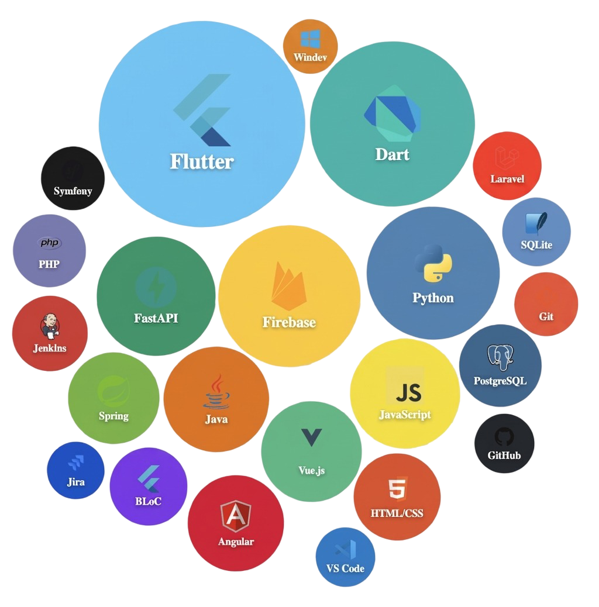

<a href="https://github.com/BuSHYoff">
  <picture>
    <source media="(prefers-color-scheme: dark)" srcset="https://readme-typing-svg.demolab.com?font=SF+Pro+Display&weight=700&size=52&duration=3000&pause=1000&color=F5F5F5&center=true&vCenter=true&width=600&height=80&lines=BuSHYoff">
    
  </picture>
</a>

 

**Baptiste Salaud** &nbsp;·&nbsp; Flutter Developer &nbsp;·&nbsp; Freelance &nbsp;·&nbsp; 🇫🇷 France

---

## À propos

Je suis passionné par l’informatique depuis le collège où j’ai commencé à développer de petits projets.

Et puis je me suis vite intéressé au métier de développeur qui réunit tous les aspects qui me correspondent : l’esprit d’équipe, la logique, l’analyse et la participation au développement de logiciels sur-mesure pour les clients.

Aider des entreprises à optimiser des actions courantes, qui sont parfois répétitives et redondantes ou bien créer avec eux, des projets partant de zéro sont pour moi une grande source de productivité. C'est donc cette notion qui me plaît et qui me pousse à réaliser ce métier qui est en pleine effervescence.

---

## Stack technique

 

 

---

## Projets réalisés

### Focus sur **Discover.**

**L'application qui transforme la curiosité en action.**
Une expérience immersive pour découvrir et pratiquer des passions de niche, du catalogue à la réalisation concrète.

| Explorer | Carte | Activité | Progression | Communauté | Profil |
|:---:|:---:|:---:|:---:|:---:|:---:|
|  |  |  |  |  |  |

#### Une expérience complète de la découverte à la pratique :

* **Système de "Journey" Interactif** : L'application ne se contente pas de lister les activités. Elle propose un parcours guidé en 3 étapes clés (Préparation du matériel, Actions de la semaine, Partage d'expérience). Ce module inclut des checklists de progression persistées localement pour transformer l'intention en habitude.
* **Exploration Géographique & Culturelle** : Via une carte du monde interactive, l'utilisateur peut explorer des passions par origine géographique. Les pays sont colorés dynamiquement selon la richesse du catalogue associé, offrant une dimension ludique à la recherche.
* **Curation de Contenu par IA** : Le cœur de l'app repose sur un dataset de plus de 170 passions qui sera amené à être enrichi par la communauté. Chaque passions est enrichie par une intelligence artificielle pour fournir des informations percutantes, des conseils spécifiques et des ressources externes pertinentes. Évidemment, certaines informations peuvent être érroné, la communauté pourra donc accéder à un support dédié pour corriger ou proposer de nouveaux avis.
* **Feed de Communauté** : Un réseau social pour chaque passions sera disponible afin d'échanger avec les experts et passionées du domaine. Vous pourrez partager tous vos contenus ici et commenter les publications de chacun.

---

 

### Garden Connect

Garden Connect est une réponse technologique innovante aux défis spécifiques des maraîchers biologiques, qui doivent composer avec des contraintes environnementales, économiques, et techniques. Ce projet vise à transformer la gestion des serres en rendant accessible une solution complète de suivi et d'analyse des données environnementales. Conçu pour être à la fois abordable et évolutif, Garden Connect combine les technologies de l'Internet des Objets (IoT), une architecture modulaire, et une interface utilisateur intuitive pour répondre aux besoins des exploitants agricoles, qu'ils soient novices ou experts en technologie.

&nbsp;

 

---

 

### BlindTest

Application Flutter de blind test musical — jeu de devinettes avec gestion des scores - connecté à Spotify

 

---

## Contact

&nbsp;

 

*Disponible pour missions freelance Flutter & fullstack · 🇫🇷 France*

---

  Made with ♥ &nbsp;·&nbsp; <code>BuSHYoff</code>

